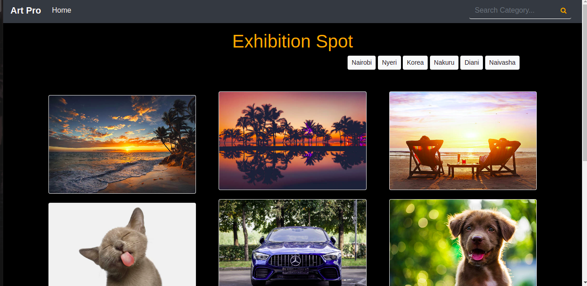
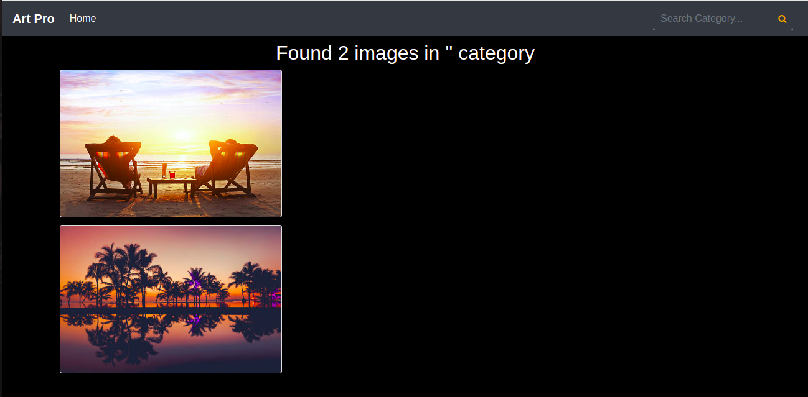

### Author
* Teresia King'ori

### Description
This is a Django application for my gallery that allows a user to upload images for others to see and be able to to share by coping the image link.The application contains image with a description and also showing location.

___

### User Story
* View different photos that interest them
* Click a single image to expand it and view the details of that photo
* Search for different categories
* Copy a link to the photo to share with my friends.
* View photos based on the location they were taken.
___
## Setup Requirements

- Git
- Web-browser or your choice
- Github
- Django 
- Pip
- Python 3.8
- PostgreSQL
- Cloudinary (for image upload) 

___

## Setup Installation

* Clone the repository:
* Navigate into the folder and install requirements
* cd gallery pip install -r requirements.txt 
* Install and activate Virtual
 - python3 -m venv virtual - source virtual/bin/activate  
* Install Dependencies
* pip install -r requirements.txt 
* Setup Database
SetUp your database User,Password, Host then make migrate

python manage.py makemigrations artgallery 
Now Migrate

python manage.py migrate 
Run the application
python manage.py runserver 
Running the application
python manage.py server 
Testing the application
python manage.py test 
Open the application on your browser 127.0.0.1:8000.
___

## Technologies Used

The following languages have been used on this project:

- HTML
- CSS
- Bootstrap
- Python
- Django
- PostgreSQL
____
### CONTACT
 Email :kingoriteresia@gmail.com

 
### LICENSE

#### &copy;2021 Teresia King'ori.